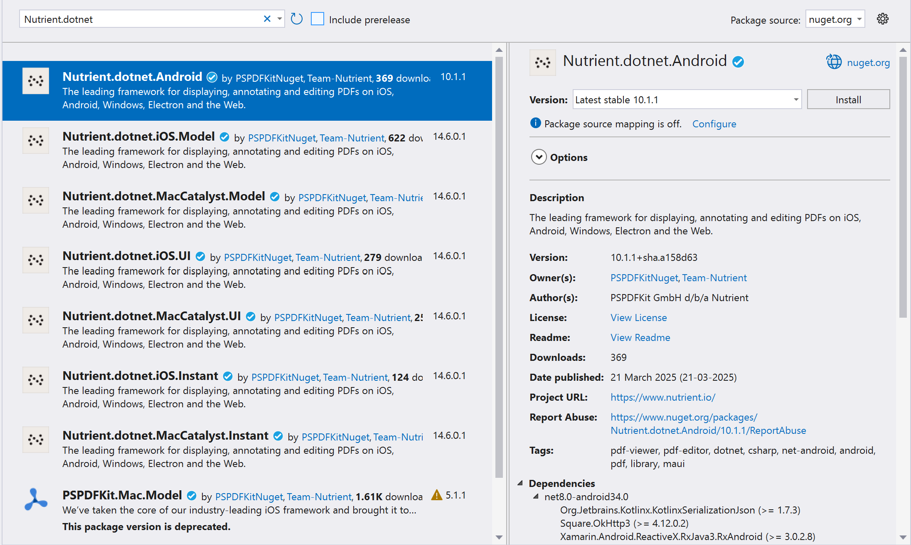

# Nutrient.NET (Android)

.NET for Android C# Bindings for Nutrient `v10.1.1`.

#### Nutrient

The [Nutrient SDK](https://nutrient.io/) is a framework that allows you to view, annotate, sign, and fill PDF forms on iOS, Android, Windows, macOS, and Web.

[Nutrient Instant](https://www.nutrient.io/guides/android/instant-synchronization/) adds real-time collaboration features to seamlessly share, edit, and annotate PDF documents.

#### Related

- Nutrient.NET (iOS): [PSPDFKit/dotnet-pdf-library-for-ios](https://github.com/PSPDFKit/dotnet-pdf-library-for-ios)
- Nutrient.NET for mobiles (iOS & Android): [PSPDFKit/dotnet-pdf-library-for-mobiles](https://github.com/PSPDFKit/dotnet-pdf-library-for-mobiles)

## Support, Issues and License Questions

Nutrient offers support via https://nutrient.io/support/request/.

Are you evaluating our SDK? That's great, we're happy to help out!
To make sure this is fast, please use a work email and have someone from your company fill out our sales form: https://www.nutrient.io/contact-sales

## Requirements

Nutrient runs on Android devices running:

* **NET for Android workload >= 33.0.95/7.0.100**
* **Microsoft Mobile OpenJDK >= 11.0**
* Android **5** or newer / API level **21** or higher
* 32-bit or 64-bit ARM (armeabi-v7a with NEON / arm64-v8a) or 32-bit or 64-bit Intel x86 CPU.
* Projects using Nutrient.dotnet.Android.dll **must** set [Target Framework](https://developer.xamarin.com/guides/android/application_fundamentals/understanding_android_api_levels/#framework) to **API 33 (Android 13.0)** or higher.

## Integrating Nutrient

There's 2 ways to integrate Nutrient into your project. We highly recommend using our nuget packages from nuget.org in Visual Studio as it requires less work for the customer and also eliminates the possibility of build errors, which can happen from time to time.

### Integrating Nutrient via NuGet (Recommended)

1. Right-Click on your project in Visual Studio and select "Manage NuGet Packages..."
2. In the `Browse` section for "nuget.org" search for "Nutrient.dotnet":



3. Select the `Nutrient.dotnet.Android` package.
4. Tap on "Add Package" to add the NuGet package to your project.

Now you are done and can skip to [Adding additional resources](https://github.com/PSPDFKit/dotnet-android#adding-additional-resources)!

### Integrating Nutrient via DLLs (Advanced)

#### Step 1 - Get Nutrient .aar File

Run `./build.sh` (on macOS) or `./build.ps1` (on Windows, PowerShell) command from root directory. This will download all the required resources needed by the binding. Note that running this will require you to have [The android workload](https://learn.microsoft.com/en-us/dotnet/core/tools/dotnet-workload-install) already installed on your computer.

**💡 Note:** Ensure the files are really named `Nutrient-Android-SDK-AAR-x.x.x.aar` so there is no hidden `.zip` file ending. OS X likes to add these things and doesn't show them by default. Use the Inspector to be sure.

Visual Studio will use the default Java, but this can be customized in Preferences -> SDK Locations -> Java SDK (JDK).

#### Step 2 - Get your Dlls

You have two options to get it:

#### Build from Nutrient.dotnet.Android.sln

1. Open `Nutrient.dotnet.Android.sln` in `Visual Studio`.
2. Build the project.
3. Get the dll from the `Nutrient.dotnet.Android/bin` folder.
4. Enjoy.

#### Build from Terminal

1. Just grab `Nutrient.dotnet.Android.dll` from the `Nutrient.dotnet.Android/bin` folder, if you successfuly followed **Step 1** it should be there.
2. Enjoy.

#### Integrating the dlls into your own Project

In order to use **Nutrient.dotnet.Android.dll** with your own project you will need to add the dll as a reference to your project. You can achieve this by doing the following:

1. Right click in your **References** folder from your project and select **Edit References...**
2. Select **.Net Assembly** tab and click **Browse**
3. Locate your **Nutrient.dotnet.Android.dll** copy and add it.

## Usage

Nutrient can display documents either in a new Activity or a Fragment you include into your hierarchy.

Note that currently only local files are supported for Nutrient.

### Checking for Compatibility

You can include Nutrient into applications which will be distributed to devices not supported by Nutrient. In that case you can attempt initializing and catch `PSPDFKitInitializationFailedException` to check for device compatibility.

* Initialize Nutrient early in your application lifecycle. You can get your license key from your [customer portal](https://my.nutrient.io/) if you haven't done so already. Pass `null` to use the trial version.

```csharp
try {
	PSPDFKitGlobal.Initialize(this, licenseKey: null);
} catch (PSPDFKitInitializationFailedException ex) {
	Console.WriteLine ("Current device is not compatible with Nutrient: {0}", ex.Message);
}
```

### Display Nutrient Activity

* Add Nutrient viewer activity to your applications **AndroidManifest.xml**

```xml
<application android:largeHeap="true">
    <activity android:name="com.pspdfkit.ui.PdfActivity"
              android:windowSoftInputMode="adjustNothing" />
</application>
```

>You can use android:theme attribute to customize actionbar, background and other elements of the activity theme if you so desire.

* Make sure you have `android:largeHeap="true"` property in your `<application>` tag in **AndroidManifest.xml**. Rendering PDF files is memory intensive and this property will ensure your app has enough heap allocated to avoid out of memory errors.

* Create `PdfActivityConfiguration` object and then call `PdfActivity.ShowDocument()` to display the document. Document location is expressed with an Uri object.

```csharp
var pdfDocument = Android.Net.Uri.FromFile (new Java.IO.File (Android.OS.Environment.ExternalStorageDirectory, "document.pdf"));
var configuration = new PdfActivityConfiguration.Builder(ApplicationContext)
            .ScrollDirection(PageScrollDirection.Horizontal)
            .PageLabelsEnabled(true)
            .ThumbnailGridEnabled(true)
            .FitMode(PageFitMode.FitToWidth)
            .Build();
PdfActivity.ShowDocument(this, pdfDocument, configuration);
```

>You can create an Uri object from file using `Android.Net.Uri.FromFile(File)` call or you can pass in Uri returned by [Storage Access Framework](https://developer.android.com/guide/topics/providers/document-provider.html). For all configuration options refer to included JavaDoc.

### Display Nutrient Fragment

* Make sure you have `android:largeHeap="true"` property in your `<application>` tag in **AndroidManifest.xml**. Rendering PDF files is memory intensive and this property will ensure your app has enough heap allocated to avoid out of memory errors.

```xml
<application android:largeHeap="true">
    ...
</application>
```

* Create `PdfConfiguration` object and then call `PdfFragment.NewInstance()` to create a new `PdfFragment` instance for a document.
* Attach the fragment to your view hierarchy. Remember that fragments are retained over configuration changes, so do not recreate fragment if it's already attached - that will lead to bugs and out of memory errors.

```csharp
var pdfDocument = Android.Net.Uri.FromFile (new Java.IO.File (Android.OS.Environment.ExternalStorageDirectory, "document.pdf"));
var configuration = new PdfActivityConfiguration.Builder(ApplicationContext)
            .ScrollDirection(PageScrollDirection.Horizontal)
            .PageLabelsEnabled(true)
            .ThumbnailGridEnabled(true)
            .FitMode(PageFitMode.FitToWidth)
            .Build();

var fragment = PdfFragment.NewInstance(pdfDocument, configuration);
SupportFragmentManager.BeginTransaction().Replace(Resource.Id.Content, fragment).Commit();
```

> Note that the `PdfFragment` extends `AndroidX.Fragment.App.Fragment` and not `Android.App.Fragment`.

### Render Page to a Bitmap

You can use Nutrient to render PDF to bitmaps without showing them in activities. To do that, use `PSPDFKitGlobal` and `PdfDocument` class calls.

Example:

```csharp
try {
	var pdfDocument = PSPDFKitGlobal.OpenDocument (this, Android.Net.Uri.FromFile (new Java.IO.File(Android.OS.Environment.ExternalStorageDirectory, "document.pdf")));
	var pageToRender = 1; // This is 0-indexed, use pdfDocument.PageCount to retrieve number of pages
	var pageBitmap = pdfDocument.RenderPageToBitmap(this,
		pageToRender,
		// This is the size of bitmap that will be generated
		pdfDocument.GetPageSize (pageToRender).Width,
		pdfDocument.GetPageSize (pageToRender).Height);
} catch (IOException ex) {
	Console.WriteLine ("Failed to open PDF document: {0}", ex.Message);
}
```

### Customization

To customize `PdfActivity` UI elements, use theme based on `Theme.AppCompat`. Nutrient will color actionbar and other elements according to `colorPrimary` and `colorAccent` attributes. Example theme definition:

```xml
<style name="MyApplicationTheme.Theme" parent="Theme.AppCompat.Light.DarkActionBar">
    <item name="colorPrimary">@color/mymain_color</item>
    <item name="colorPrimaryDark">@color/mymain_color_dark</item>
    <item name="colorAccent">@color/mymain_color_accent</item>
</style>
```

And then it should be applied in AndroidManifest.xml:

```xml
<activity android:name="com.pspdfkit.ui.PdfActivity"
      android:windowSoftInputMode="adjustNothing"
      android:theme="@style/MyApplicationTheme.Theme" />
```

Other configuration options for UI elements (icons, element sizes) can be found in `PdfActivityConfiguration` class.

### More Information

For more documentation about Nutrient check out [Nutrient online documentation](https://www.nutrient.io/guides/android/) and bundled Javadoc.

# Nutrient Instant

With Nutrient Instant, it’s easier than ever to add real-time collaboration features to your Nutrient-powered app, allowing your users to seamlessly share, edit, and annotate PDF documents across iOS, Android, and web. With just a few lines of code, Nutrient Instant gives your users a massive productivity boost.

For more information about Instant, please have a look at our [website](https://www.nutrient.io/guides/android/instant-synchronization/).

# Examples

You can find several sample projects in the `samples` folder.

### AndroidSample

`AndroidSample` is an example project showing showing how to open and present document, or how to open a document from various file providers or the local file directory.

### Contributing

Please ensure [you signed our CLA](https://www.nutrient.io/guides/web/miscellaneous/contributing/) so we can accept your contributions.

[Instant Example]: https://github.com/PSPDFKit/Xamarin-Android/tree/master/samples/PSPDFCatalog/Catalog/Instant
